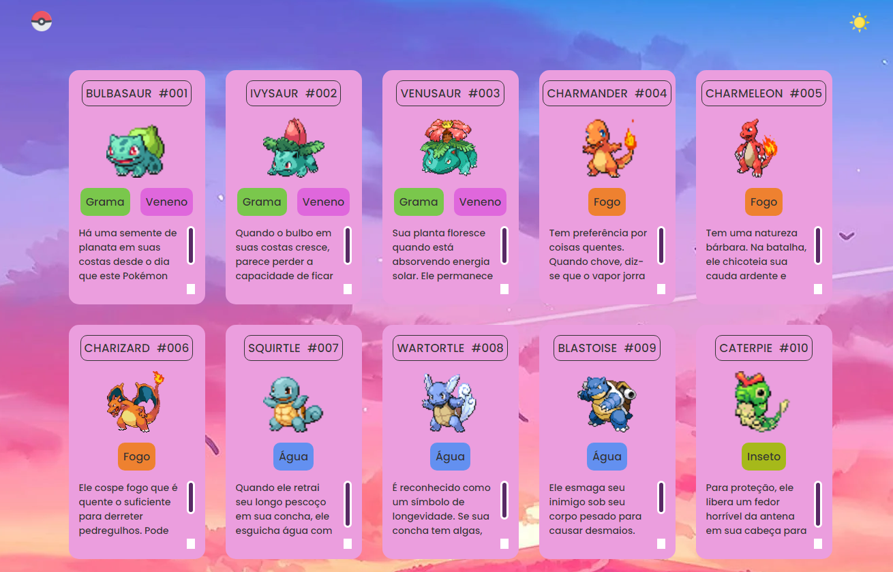

# Projeto Lista Pokemon

> O projeto tem como principal funcionalidade demonstrar o domínio sobre funcionalidades de HTML, CSS e JavaScript para listar de maneira sucinta Pokémons.  

O projeto ainda está Finalizado.

## 💻 Pré-requisitos

Antes de começar, verifique se você atendeu aos seguintes requisitos:
* Você tem uma máquina Windows, Linux ou Mac.

<table>
  <tr>
    <td align="center">
      <a href="#">
         
        
          <b>Guilho</b>
        
      </a>
    </td>
  </tr>
</table>

## 😄 Seja um dos contribuidores 

Quer fazer parte desse projeto? Clique [AQUI](CONTRIBUTING.md) e leia como contribuir.

## 📝 Licença

Esse projeto está sob licença. Veja o arquivo [LICENÇA](LICENSE.md) para mais detalhes.

[⬆ Voltar ao topo](#nome-do-projeto) 
